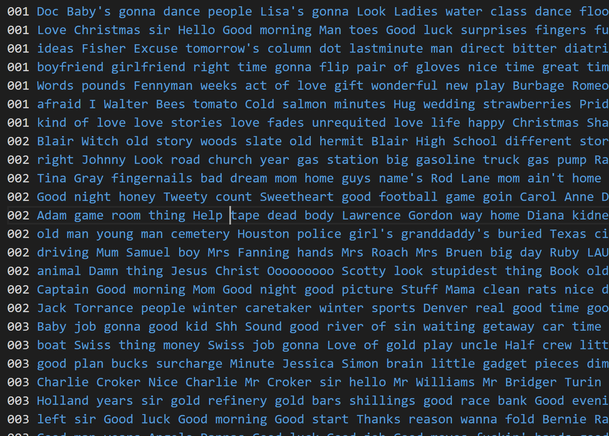

# rom-com-or-not-rom-com
Rom-com or not rom-com is an ML.NET project designed to examine a text document and determine if it exhibits the classic characteristics of Rom-com film (or horror, heist,  comedy or science fiction film).

It was inspired by [Mark Kermode's Secrets of Cinema](https://www.bbc.co.uk/programmes/b0bbn5pt) excellent series on the BBC, which examines classic film genres, such as rom-coms, comedies, etc, and explores the structures, formats, film techniques and plot points that are common to each of these genres.

In the project we take a somewhat less sophisticated approach to this same concept, but instead we do textual analysis on a whole bunch of movie scripts, by genre, and then use a classification machine learning algorithm to codify this, so that we can then take an arbitrary piece of text and rate it for the likelihood of it being in one of the genres we have analysed. So, with a big Hello to Jason Isaacs, let's see how it works....

# Getting Going

This project is easy to get up and going, and at its core, boils down to a three stage process

- Run the Script Builder to churn through lots of film scripts and use Azure  Text Analytics to build up a "database" of key words and phrases for each file
- Use Model Builder to create, train and save an ML.NET machine learning model (and do a quick prediction check) 
- Use the PredictAPI .net core web app to post a body of text for analysis using the saved machine learning model 

You can of course then wrap the API behind any application you want.

# Scrip Builder 

Script Builder uses Azure Text Analytics to detect sentiment, key phrases, named entities and language from a body of text. We use this service to analyse and process a whole load of movie scripts, each off which we have to label up front with its genre.

We can't legally share or distribute film scripts, but there are many websites on-line that contain copies of most  popular film scripts for research etc. Put each film script in the .\scripts folder and ensure each file starts with a single digit and an underscore:

- 1_rom com.txt
- 2_horror.txt
- 3_heist.txt
- 4_comedy.txt
- 5_science fiction.txt

There are some dummy text placeholders in this directory to start you off - simply delete them and replace them with the film scripts.

You will need an Azure subscription to perform the text analytics processing. If you don't have one, visit https://azure.microsoft.com/free/ 

Go to [Azure Text Analytics](https://azure.microsoft.com/en-gb/services/cognitive-services/text-analytics/) and obtain a Text Analytics key. There is a free version with a cap of 5,000 free transactions per month.

At the command line, run this command

    dotnet  script  .\ScriptProcessor.csx  TEXTANALYTICSKEY

Depending on the scripts you have sourced, you should see something  like this:

The  Azure Text Analytics has a limit of 5,000 characters per call, so the application breaks the scripts down into 5,000 character chunks, breaking only on white space, not mid word.

The output from this process is a tab separated file, data.tsv, that contains the data for the machine learning model. It has one line per analysed film, and two columns:

- Label: 001 for rom-com, 002 for horror, etc
- Key Phrases: The de-duped text from the Azure Text Analytics

This is an example of the data file, showing some of the key words the text analytics process extracted:

# Model Builder

Having created the data.tsv file, the next stage is to build a machine learning model. We use a multi-class classification model, where we get a probabiity from the model for each of the genres. This is essentially like running a binary classifier for each of the genre types we hold information on. [Sentiment analysis](https://github.com/dotnet/machinelearning-samples/tree/master/samples/csharp/getting-started/BinaryClassification_SentimentAnalysis) is a classic example of a binary classifier, where the goal is to predict if a piece of text has a positive or negative sentiment, based on supervised learning data set that has already been classified.

The tutorial [Categorize support issues using multiclass classification with](https://docs.microsoft.com/en-us/dotnet/machine-learning/tutorials/github-issue-classification) takes you through the process in more detail if you want to go through this process step by step.

To use the model builder, at the command line run this command

	dotnet script ModelBuilder.csx  [train | load]  'some words to test'

The fist time you run this command, or when the data.tsv file has been updated, you need to run the command with the "train" option, so it builds and saves the model. As this can take several minutes depending on the szie of the data, subsequent runs can use the "load" option to load the  previously saved model.

Train:

Load:

Notice how Model Builder also does a predictive test on a phrase you can pass in on the command line, just as a quick test to validate the model. As you can see from the above screen shots, there is a very high probabilty that this is rom-com, with a small chance it might be a horror. 

# Predict Web API

